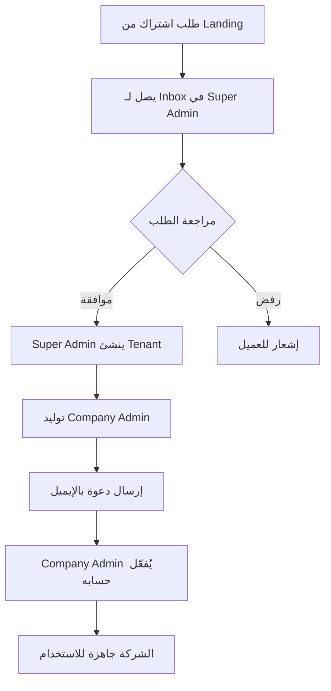

# 📖 تعريفات المنتج - Ujoors (أجور)

> هذا الملف يوثق المفاهيم الأساسية للمنتج ويجب تحديثه مع كل تغيير جوهري

---

## 🏢 نموذج Multi-Tenancy

### ما هو الـ Tenant؟
الـ Tenant هو **الشركة/المؤسسة** التي تستخدم منصة أجور. كل شركة لها:
- بياناتها المعزولة تمامًا
- إعداداتها الخاصة
- مستخدميها

### كيف يتم تحديد الـ Tenant؟
```
الطريقة الأساسية: Subdomain
- الشركة: acme → acme.ujoors.com
- الشركة: riyadh-co → riyadh-co.ujoors.com

محليًا (Development):
- acme.localhost:3000
- riyadh-co.localhost:3000
```

### لا يوجد Self-Signup
- ❌ الشركات لا تستطيع التسجيل ذاتيًا
- ✅ Super Admin فقط ينشئ الشركات
- ✅ Landing Page فيها نموذج "طلب اشتراك" يوصل لـ Inbox داخلي

---

## 👥 الأدوار (Roles)

### 1. Super Admin (مدير المنصة)
- **المستوى**: داخلي - فريق Ujoors فقط
- **الصلاحيات**:
  - إنشاء/تعديل/تعليق الشركات (Tenants)
  - إدارة الاشتراكات والفواتير
  - التحكم في الثيمات المتاحة
  - مراجعة طلبات الاشتراك
  - الوصول لكل البيانات (للدعم الفني)

### 2. Company Admin (مدير الشركة)
- **المستوى**: على مستوى الشركة
- **الصلاحيات**:
  - إدارة كل بيانات الشركة
  - إنشاء/تعديل المستخدمين والأدوار
  - تغيير إعدادات الشركة (الثيم، اللغة)
  - إدارة الأقسام والهيكل التنظيمي

### 3. Manager (مدير)
- **المستوى**: على مستوى القسم/الفريق
- **الصلاحيات**:
  - إدارة فريقه فقط
  - الموافقة على الطلبات (إجازات، مصروفات)
  - عرض تقارير الفريق
  - تقييم الأداء

### 4. Employee (موظف)
- **المستوى**: على مستوى الفرد
- **الصلاحيات**:
  - عرض بياناته الشخصية
  - تقديم الطلبات (إجازة، مصروفات)
  - تسجيل الحضور
  - عرض كشف راتبه

---

## 🌐 اللغة والاتجاه (i18n & RTL)

### اللغات المدعومة
- **العربية (ar)**: اللغة الافتراضية
- **الإنجليزية (en)**: لغة ثانوية

### كيف يتم تحديد اللغة؟
1. من Cookie: `ujoors_locale`
2. الافتراضي: `ar`

### RTL/LTR
- العربية → `dir="rtl"`
- الإنجليزية → `dir="ltr"`

### الخط
- **IBM Plex Sans Arabic**: للعربية والإنجليزية
- مُستضاف محليًا في `/app/fonts/`

---

## 🎨 الثيمات (Themes)

### نظام الثيمات
```
المستوى 1: Light/Dark Mode
- يتحكم به المستخدم
- يُحفظ في localStorage عبر next-themes

المستوى 2: UI Theme (الشكل العام)
- Theme A: shadcn (الافتراضي)
- Theme B: mantine (تجريبي)
- يُحفظ في Cookie: ujoors_ui_theme
```

### من يتحكم في الثيم؟
- **Super Admin**: يحدد الثيمات المتاحة للمنصة
- **Company Admin**: يختار الثيم الافتراضي للشركة
- **المستخدم**: يمكنه التبديل بين Light/Dark

---

## 🔐 المصادقة (Authentication)

### نظام المصادقة الحالي (Skeleton)
```typescript
// الجلسة تُحفظ في Cookie مشفر
Cookie: ujoors_session

// محتوى الجلسة
{
  user: { id, email, name, role, tenantId },
  accessToken: string,
  expiresAt: timestamp
}
```

### النظام المستهدف (لاحقًا)
- JWT Access Tokens (15 دقيقة)
- Refresh Tokens (7 أيام)
- 2FA اختياري

---

## 📁 هيكل الملفات المهمة

```
d:\Mahmoud\hghvadt\Jisr\
├── UJOORS_PLATFORM_COMPLETE_PLAN.md  ← الخطة (لا تُحذف!)
├── docs/
│   └── PRODUCT_DEFINITIONS.md        ← هذا الملف
├── i18n/
│   ├── messages/ar.json              ← ترجمات عربية
│   ├── messages/en.json              ← ترجمات إنجليزية
│   └── request.ts                    ← إعداد next-intl
├── lib/
│   ├── auth.ts                       ← وظائف المصادقة
│   ├── guards.ts                     ← حراسة الصفحات
│   ├── tenant.ts                     ← وظائف Multi-tenancy
│   └── design-tokens.ts              ← قيم التصميم
├── app/
│   ├── layout.tsx                    ← Root Layout + Font
│   ├── globals.css                   ← Tailwind + CSS Vars
│   └── fonts/                        ← خطوط محلية
└── proxy.ts                          ← Tenant/Locale resolver
```

---

## 📊 حالات الشركة (Tenant Status)

| الحالة | الوصف | الوصول |
|--------|-------|--------|
| `ACTIVE` | شركة نشطة | كامل |
| `SUSPENDED` | معلقة (عدم سداد مثلاً) | للقراءة فقط |
| `DELETED` | محذوفة (soft delete) | لا وصول |

---

## 🔄 سير العمل: إنشاء شركة جديدة



---

## 📝 ملاحظات للمطورين

1. **كل Query/API يجب أن يتضمن tenantId**
   - لا استثناءات إلا لـ Super Admin

2. **الترجمة**
   - استخدم مفاتيح من `i18n/messages/*.json`
   - لا تكتب نصوص hardcoded

3. **الصلاحيات**
   - استخدم `guardAuth()`, `guardRole()` في الصفحات
   - تحقق من الصلاحيات في API routes أيضًا

4. **الثيم**
   - كل المكونات يجب أن تعمل في Light و Dark
   - استخدم CSS Variables من `globals.css`

---

آخر تحديث: 2026-01-24
